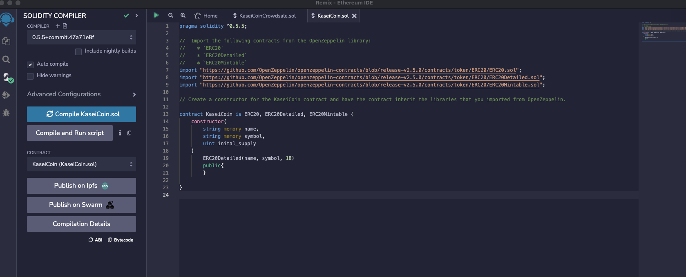
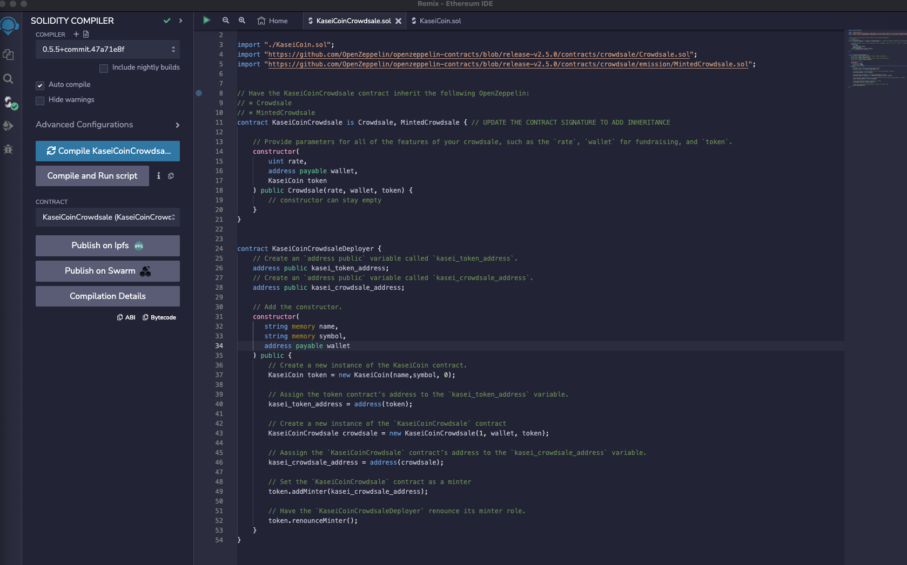

# KaseiCoin ICO

## Background

After waiting for years and passing several tests, the Martian Aerospace Agency selected you to become part of the first human colony on Mars. As a prominent fintech professional, they chose you to lead a project developing a monetary system for the new Mars colony. You decided to base this new system on blockchain technology and to define a new cryptocurrency named **KaseiCoin**. (Kasei means Mars in Japanese.)

KaseiCoin will be a fungible token that’s ERC-20 compliant. You’ll launch a crowdsale that will allow people who are moving to Mars to convert their earthling money to KaseiCoin.

## Prerequisites

- Solidity 0.5.5
- OpenZeppelin Contracts v2.5.0

## Contracts

### KaseiCoin
KaseiCoin is an ERC20 token that inherits the ERC20, ERC20Detailed, and ERC20Mintable contracts from OpenZeppelin. The constructor takes the token's name, symbol, and initial supply as parameters and sets the token's details accordingly.
[KaseiCoinCrowdsale.sol](./Starter_Code/KaseiCoinCrowdsale.com)

### KaseiCoinCrowdsale
KaseiCoinCrowdsale is a contract that handles the ICO for KaseiCoin. It inherits from the OpenZeppelin's Crowdsale and MintedCrowdsale contracts. The constructor accepts the ICO rate (how many tokens one Ether buys), the wallet address to collect the raised funds, and the KaseiCoin token contract.

### KaseiCoinCrowdsaleDeployer
KaseiCoinCrowdsaleDeployer is a contract that deploys the KaseiCoin token and the KaseiCoinCrowdsale contracts. It initializes the token contract and sets the crowdsale contract as a minter, then renounces its own minter role.

## Usage

Deploy the KaseiCoinCrowdsaleDeployer contract, providing the token's name, symbol, and the wallet address to collect the raised funds.
Retrieve the addresses of the deployed KaseiCoin and KaseiCoinCrowdsale contracts from the kasei_token_address and kasei_crowdsale_address variables in the deployer contract.
Interact with the KaseiCoin and KaseiCoinCrowdsale contracts using their respective ABI and addresses from step 2.

## Results

